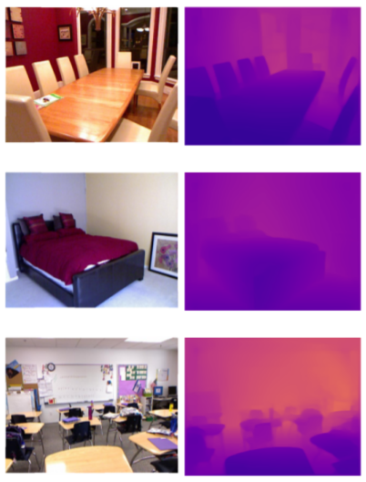

# Monocular Depth Estimation on NYU dataset

This project demonstrates development of a  monocular depth estimation network which is adapted from [High Quality Monocular Depth Estimation via Transfer Learning](https://arxiv.org/abs/1812.11941). 

